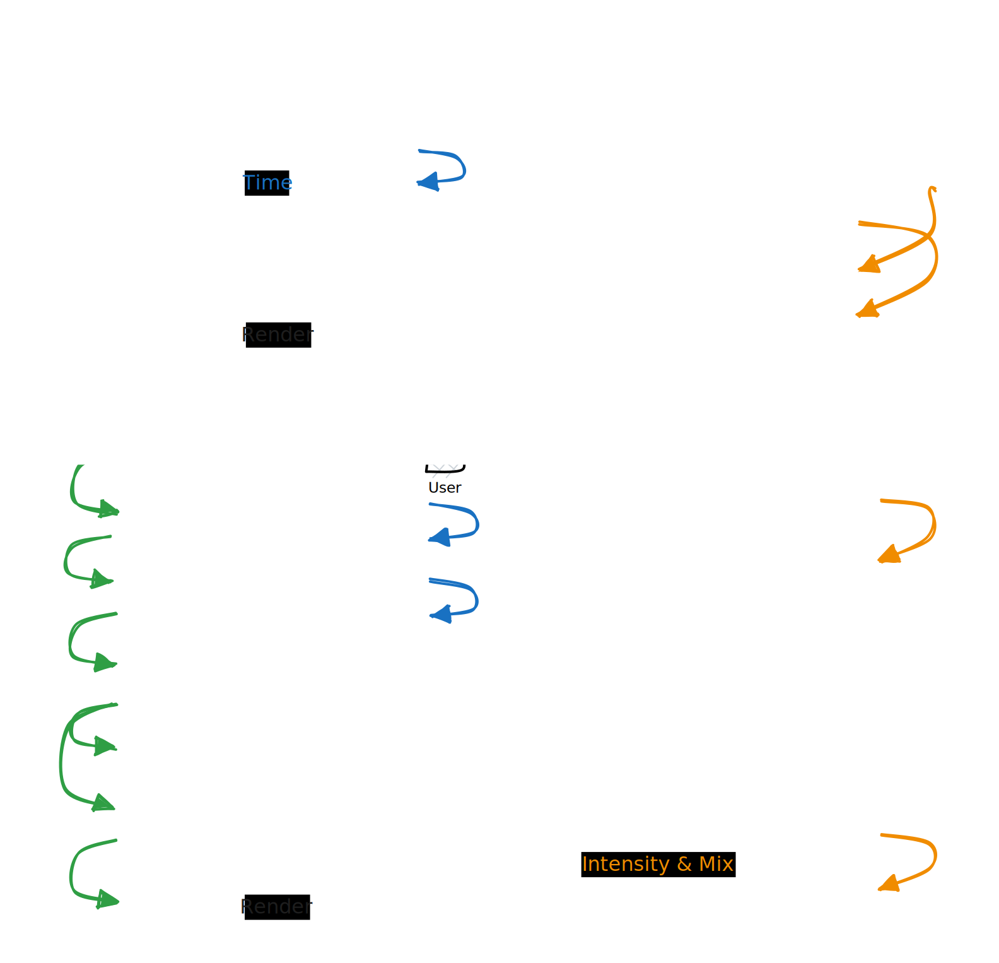

# Carbon Intensity Forecasting

This is very simple example of an app built using
[Crux](https://github.com/redbadger/crux) built solely for the purposes of
demonstrating orchestration of multiple API calls to backend services.

> Note: the APIs are UK specific, and so the app will not work as intended
> outside of the UK.

## Overview

The core of the app responds to 2 events — one for getting national
[intensity and generation mix forecasts](https://carbonintensity.org.uk/) for
the next 24 hours, and one for local forecasts. The local path uses the latitude
and longitude of the user's location (from the host device), reverse geocoded to
a postcode (using [Postcodes.io](https://api.postcodes.io/)). The app then calls
the
[National Grid API](https://carbon-intensity.github.io/api-definitions/?shell#carbon-intensity-api-v2-0-0)
to get the local intensity and generation mix forecast for the next 24 hours.

## iOS

The iOS app is written in Swift, with
[Swift UI](https://developer.apple.com/xcode/swiftui/) and
[Swift Charts](https://developer.apple.com/documentation/charts) for displaying
the data.

## Android

The Android app is written in Kotlin, with
[Jetpack Compose](https://developer.android.com/jetpack/compose), and the graphs
are hand built.

## Web

The web app is written in TypeScript, with [Remix](https://remix.run/), and the
graphs use [Chart.js](https://www.chartjs.org/).
